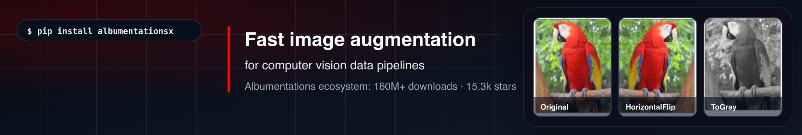

<p align="center">
  
</p>

<p align="center">
  <a href="https://albumentations.ai/?utm_source=github&amp;utm_medium=referral&amp;utm_campaign=org_profile"></a>
  <a href="https://albumentations.ai/docs/?utm_source=github&amp;utm_medium=referral&amp;utm_campaign=org_profile"></a>
  <a href="https://albumentations.ai/explore/?utm_source=github&amp;utm_medium=referral&amp;utm_campaign=org_profile"></a>
  <a href="https://github.com/sponsors/albumentations-team"></a>
</p>

Albumentations is a widely adopted open-source image-augmentation ecosystem for
computer vision. It helps engineers and researchers create valid training
variation while keeping images, masks, bounding boxes, keypoints, volumes, and
video frames synchronized.

## Start new work with AlbumentationsX

[AlbumentationsX](https://github.com/albumentations-team/AlbumentationsX) is the
actively developed library in the ecosystem. Install it with OpenCV for
headless servers and training environments:

```bash
pip install "albumentationsx[headless]"
```

The package preserves the familiar `albumentations` import path:

```python
import albumentations as A

transform = A.Compose(
    [
        A.RandomCrop(height=256, width=256),
        A.HorizontalFlip(p=0.5),
        A.RandomBrightnessContrast(p=0.2),
    ]
)

augmented = transform(image=image, mask=mask)
```

Use the [documentation](https://albumentations.ai/docs/?utm_source=github&utm_medium=referral&utm_campaign=org_profile)
for guides and API details, or open [Explore](https://albumentations.ai/explore/?utm_source=github&utm_medium=referral&utm_campaign=org_profile)
to test transforms in the browser.

## The ecosystem

| Component | What it provides |
| --- | --- |
| [**AlbumentationsX**](https://github.com/albumentations-team/AlbumentationsX) | Actively developed augmentation pipelines for images and synchronized annotations. |
| [**Website and documentation**](https://albumentations.ai/) | Project homepage, guides, API documentation, blog, benchmarks, and transform reference. |
| [**Explore**](https://albumentations.ai/explore/) | Interactive browser playground for trying every transform on user-uploaded images. |
| [**Albucore**](https://github.com/albumentations-team/albucore) | Optimized atomic image-processing functions with workload-aware backend selection. |
| [**albu-spec**](https://github.com/albumentations-team/albu-spec) | Structured, typed metadata extracted from AlbumentationsX transforms. |
| [**Benchmark suite**](https://github.com/albumentations-team/benchmark) | Reproducible image, multichannel, video, and DataLoader comparisons. |
| [**Examples**](https://github.com/albumentations-team/albumentations_examples) | Runnable notebooks for classification, segmentation, detection, keypoints, replay, serialization, and integrations. |
| [**Albumentations**](https://github.com/albumentations-team/albumentations) | The MIT-licensed legacy library, preserved for reproducibility, continued use, and forks. |

## Public adoption

<table>
  <tr>
    <td align="center"><a href="https://albumentations.ai/adoption/?utm_source=github&amp;utm_medium=referral&amp;utm_campaign=org_profile"><strong>160.7M</strong><br>PyPI downloads</a></td>
    <td align="center"><a href="https://albumentations.ai/adoption/?utm_source=github&amp;utm_medium=referral&amp;utm_campaign=org_profile"><strong>15.3k</strong><br>GitHub stars</a></td>
    <td align="center"><a href="https://albumentations.ai/adoption/github/?utm_source=github&amp;utm_medium=referral&amp;utm_campaign=org_profile"><strong>40k+</strong><br>GitHub-reported public dependents</a></td>
    <td align="center"><a href="https://albumentations.ai/adoption/papers/?utm_source=github&amp;utm_medium=referral&amp;utm_campaign=org_profile"><strong>2,270</strong><br>citing research works</a></td>
  </tr>
</table>

These figures describe public ecosystem adoption, not paid customers or
endorsements. Downloads were checked on
[pepy.tech](https://pepy.tech/projects/albumentations),
[stars](https://github.com/albumentations-team/albumentations/stargazers) and
[public dependents](https://github.com/albumentations-team/albumentations/network/dependents)
on GitHub, and [research works](https://albumentations.ai/adoption/papers/) in
the deduplicated adoption snapshot on 22 July 2026. Browse the wider
[public adoption evidence](https://albumentations.ai/adoption/).
Albumentations is a
[NumFOCUS Affiliated Project](https://numfocus.org/sponsored-projects/affiliated-projects).

## Licensing

[AlbumentationsX](https://github.com/albumentations-team/AlbumentationsX)
offers two licensing options:

- **Commercial license:** agree on alternative rights for proprietary applications
  and services, with coverage for your teams, products, and customer deployments.
  Your agreement with Albumentations, LLC defines the scope, price, and term.
  [Request a quote](https://albumentations.ai/pricing?utm_source=github&utm_medium=referral&utm_campaign=org_profile).
- **AGPL-3.0-only:** available at no charge, including for commercial use, subject
  to its terms. Commercial or proprietary status alone does not require a
  purchase. Read the [license guide](https://albumentations.ai/docs/license/).

The legacy [`albumentations`](https://github.com/albumentations-team/albumentations)
package and repository remain available under the MIT License.

## Join the project

- Read the [contribution guide](https://github.com/albumentations-team/AlbumentationsX/blob/main/CONTRIBUTING.md) and help improve AlbumentationsX.
- Ask usage questions and meet other practitioners on [Discord](https://discord.gg/AKPrrDYNAt).
- Follow releases and tutorials through the [newsletter](https://albumentations.ai/subscribe?utm_source=github&utm_medium=referral&utm_campaign=org_profile).
- Support long-term maintenance through [GitHub Sponsors](https://github.com/sponsors/albumentations-team).

Sponsorship supports maintenance; it does not include a commercial license or
support agreement.

<p align="center">
  <a href="https://github.com/albumentations-team/AlbumentationsX">Code</a>
  ·
  <a href="https://albumentations.ai/docs/?utm_source=github&amp;utm_medium=referral&amp;utm_campaign=org_profile">Docs</a>
  ·
  <a href="https://albumentations.ai/explore/?utm_source=github&amp;utm_medium=referral&amp;utm_campaign=org_profile">Explore</a>
  ·
  <a href="https://albumentations.ai/docs/benchmarks/image-benchmarks/?utm_source=github&amp;utm_medium=referral&amp;utm_campaign=org_profile">Benchmarks</a>
  ·
  <a href="https://github.com/sponsors/albumentations-team">Sponsor</a>
</p>
